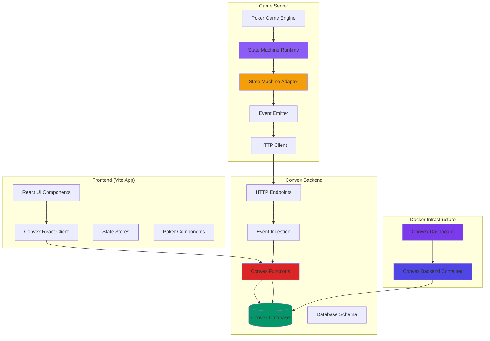
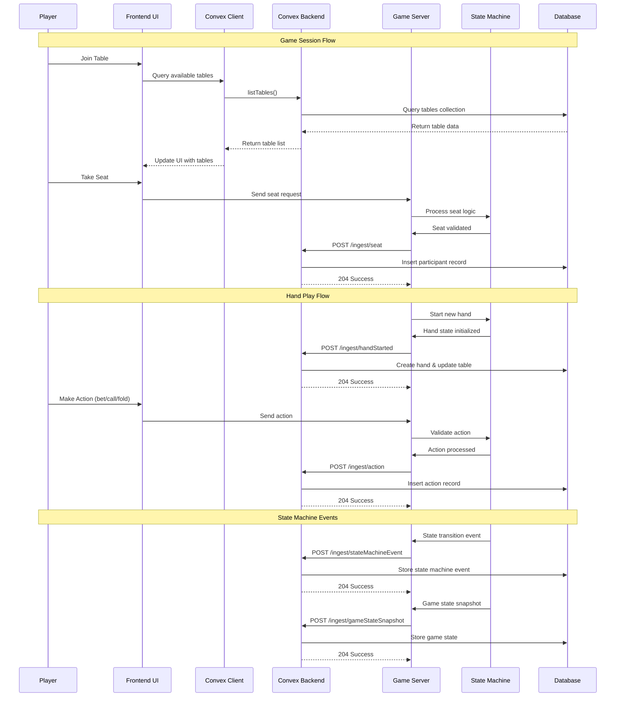

# Convex Integration Architecture

This document provides visual representations of how Convex is integrated into the Monte Carlo poker application.

## System Overview

The application uses Convex as a real-time database backend with the following key components:

- **Convex Backend**: Self-hosted Convex instance running in Docker
- **Game Server**: Node.js backend with state machine integration that ingests poker game events
- **Frontend**: Vite-based React application using Convex queries for real-time updates
- **Database Schema**: Poker-specific data model for tables, hands, players, actions, and state machine events
- **State Machine**: Comprehensive game flow management system integrated with Convex

## Architecture Diagram



## Data Flow Diagram



## Current Implementation Details

### HTTP Endpoints

The system implements the following HTTP endpoints for real-time event ingestion:

| Endpoint | Method | Purpose | Authentication |
|-----------|--------|---------|----------------|
| `/ingest/health` | GET | Health check and debug counts | None |
| `/ingest/handStarted` | POST | Hand start event | `x-convex-ingest-secret` |
| `/ingest/action` | POST | Player action event | `x-convex-ingest-secret` |
| `/ingest/handEnded` | POST | Hand end event | `x-convex-ingest-secret` |
| `/ingest/seat` | POST | Player seated event | `x-convex-ingest-secret` |
| `/ingest/unseat` | POST | Player unseated event | `x-convex-ingest-secret` |
| `/ingest/deal` | POST | Card deal event | `x-convex-ingest-secret` |
| `/ingest/stateMachineEvent` | POST | State machine event | `x-convex-ingest-secret` |
| `/ingest/gameStateSnapshot` | POST | Game state snapshot | `x-convex-ingest-secret` |
| `/ingest/potHistoryEvent` | POST | Pot history event | `x-convex-ingest-secret` |

### State Machine Integration

The current implementation includes a comprehensive state machine system that:

- **Manages Game Flow**: Handles transitions between preflop, flop, turn, river, and showdown
- **Validates Actions**: Ensures player actions are valid for the current game state
- **Tracks Context**: Maintains betting rounds, pot states, and player positions
- **Integrates with Convex**: Sends state machine events to the backend for persistence
- **Provides Debug Controls**: Includes runtime debug mode toggling for development

### Frontend Integration

The frontend uses Convex queries for real-time updates:

- **Convex Client**: Configured with environment-based URL
- **React Components**: Use `useQuery` hooks for real-time data
- **Poker Components**: Hand replay and history components with live updates
- **State Management**: Convex handles real-time state synchronization

### Database Schema

The current schema includes:

- **Core Tables**: users, tables, participants, hands, actions
- **State Machine Tables**: gameStateSnapshots, stateMachineEvents, potHistoryEvents
- **Configuration**: config table for application settings
- **Indexes**: Optimized for common query patterns

## Integration Patterns

### Event Ingestion Pattern

```typescript
// Game server sends events to Convex
const convex = new ConvexPublisher({ 
  baseUrl: process.env.CONVEX_INGEST_URL + '/http', 
  secret: process.env.INSTANCE_SECRET 
});

// Events are sent via HTTP POST
await convex.handStarted({
  eventId: generateEventId(),
  tableId: tableId,
  handId: handId,
  // ... other data
});
```

### Frontend Query Pattern

```typescript
// React components use Convex queries
const recentHands = useQuery(api.history.listRecentHands, {});
const handDetail = useQuery(
  api.history.getHandDetail, 
  selectedHandId ? { handId: selectedHandId } : 'skip'
);
```

### State Machine Integration Pattern

```typescript
// State machine events are captured and sent to Convex
const stateMachineAdapter = new StateMachineAdapter(convex, tableId);

stateMachineAdapter.captureActionProcessed(actionType, seatIndex, {
  street: currentStreet,
  amount: betAmount,
  playerToken: playerToken
});
```

## Current Status

✅ **Fully Implemented**:
- Convex backend with comprehensive schema
- HTTP-based event ingestion
- State machine integration
- Frontend real-time updates
- Debug controls and monitoring

🎯 **Production Ready**:
- Authentication and idempotency
- Error handling and recovery
- Performance optimization
- Scalable architecture

The Convex integration provides a robust, real-time foundation for the poker application with comprehensive state management and efficient data synchronization.
