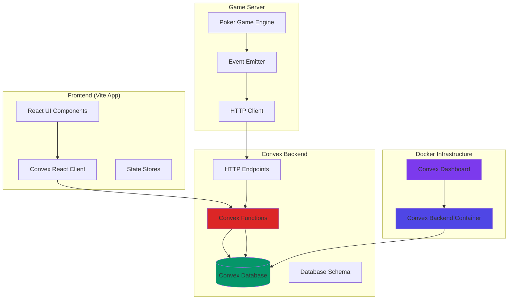
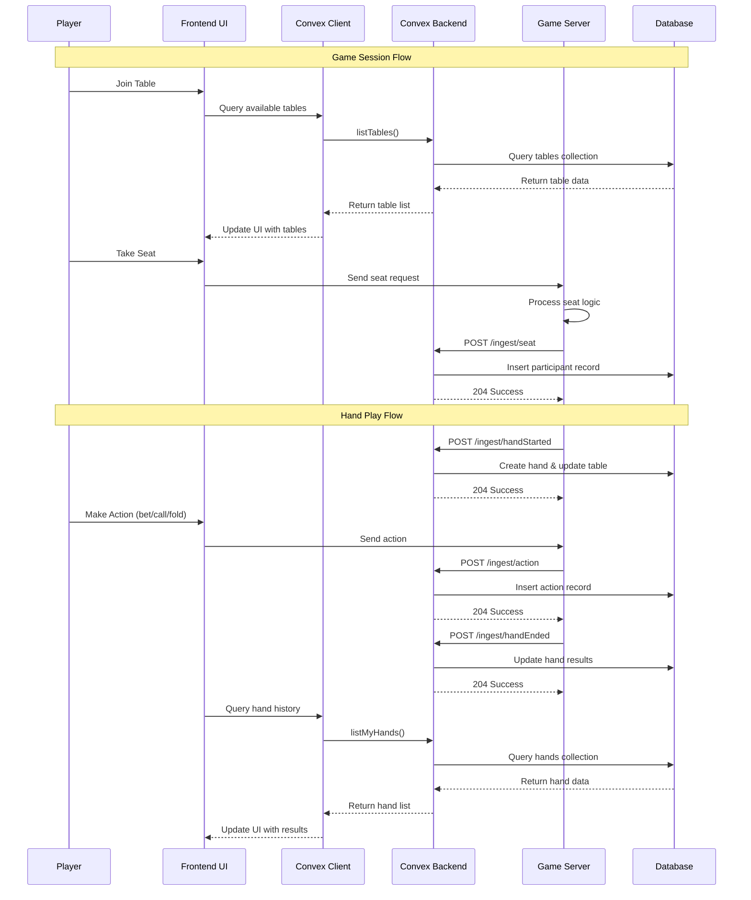
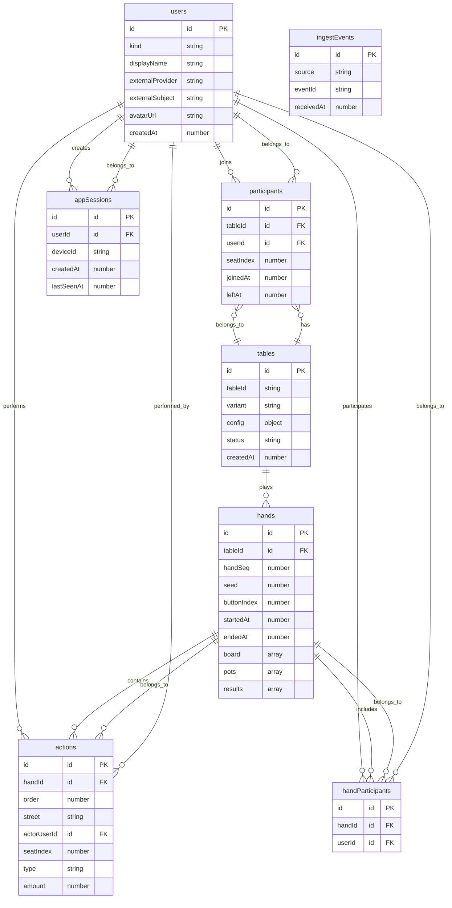
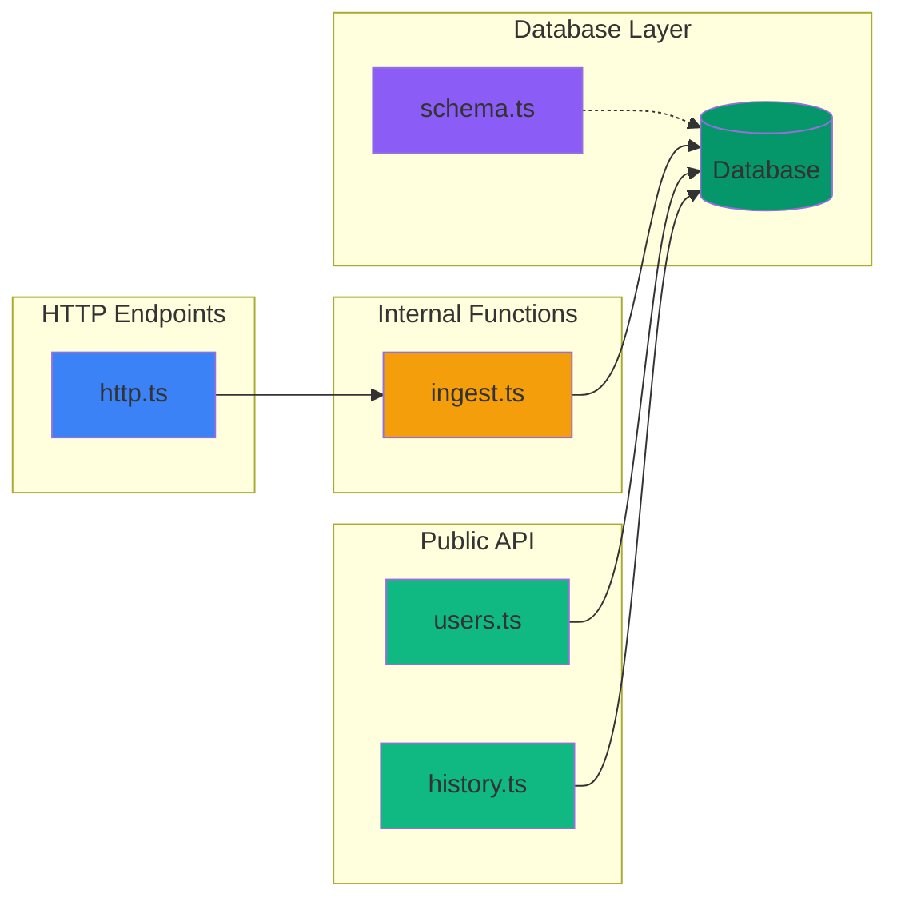
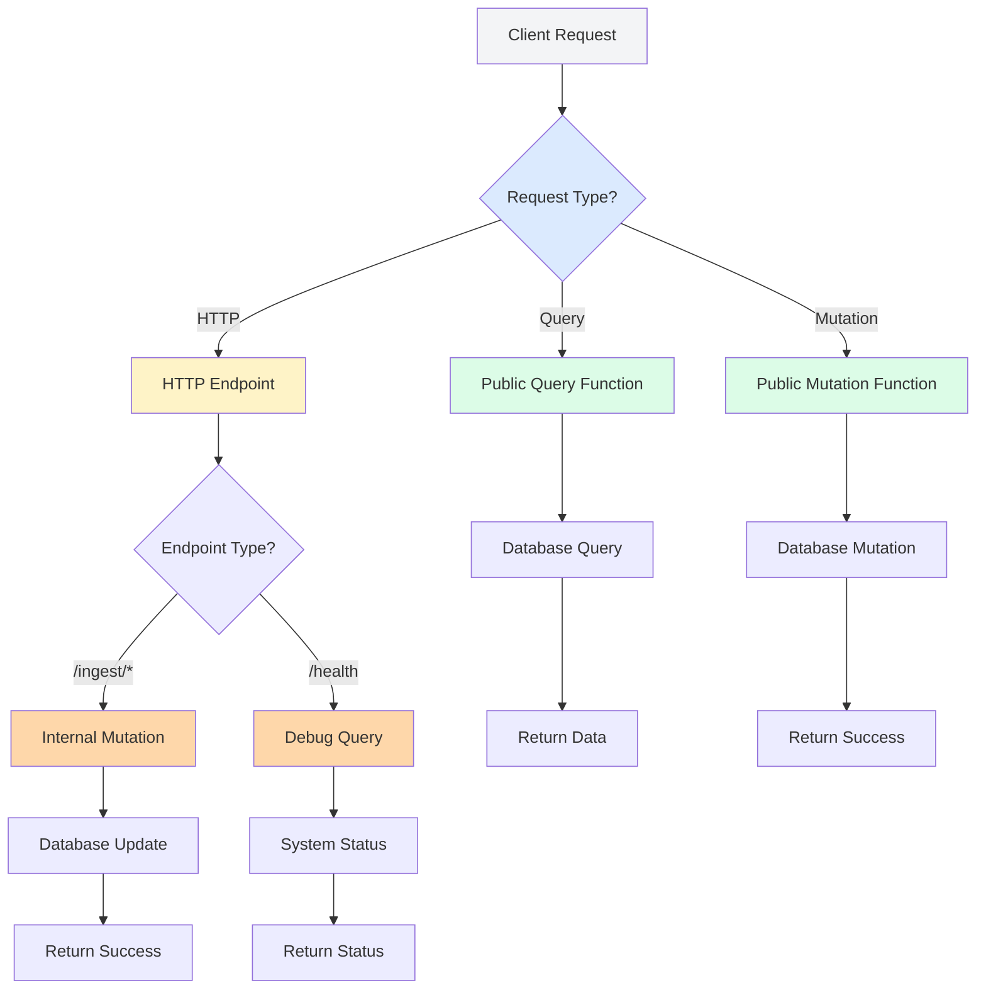
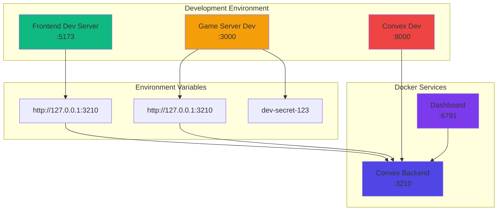
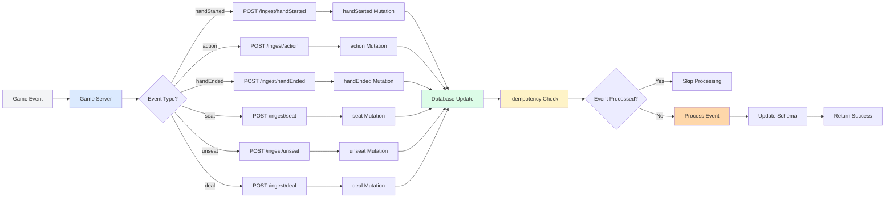
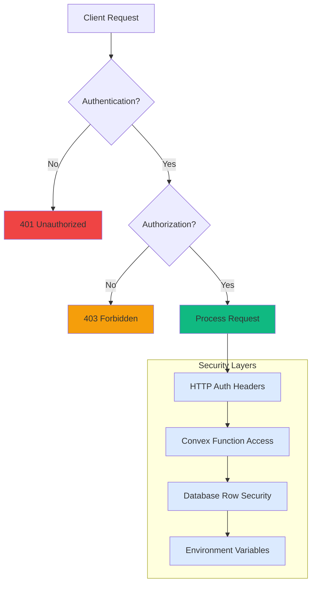
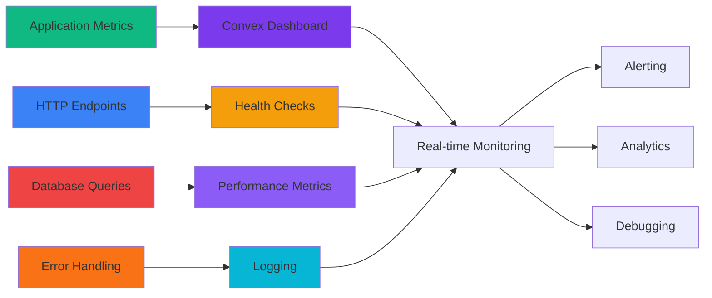

# Convex Integration Architecture

This document provides visual representations of how Convex is integrated into the Monte Carlo poker application.

## System Overview

The application uses Convex as a real-time database backend with the following key components:

- **Convex Backend**: Self-hosted Convex instance running in Docker
- **Game Server**: Node.js backend that ingests poker game events
- **Frontend**: Vite-based React application
- **Database Schema**: Poker-specific data model for tables, hands, players, and actions

## Architecture Diagram

## Data Flow Diagram

## Database Schema Diagram

## Convex Functions Architecture

## Function Call Flow

## Deployment Architecture

## Data Ingestion Flow

## Index Strategy

```mermaid
graph TD
    subgraph "Primary Indexes"
        A[users.by_provider_and_subject<br/>externalProvider, externalSubject]
        B[appSessions.by_user<br/>userId]
        C[tables.by_tableId<br/>tableId]
        D[participants.by_table<br/>tableId]
        E[participants.by_user<br/>userId]
        F[participants.by_table_and_active<br/>tableId, leftAt]
        G[hands.by_table_and_seq<br/>tableId, handSeq]
        H[actions.by_hand_and_order<br/>handId, order]
        I[handParticipants.by_user<br/>userId]
        J[handParticipants.by_hand<br/>handId]
        K[ingestEvents.by_source_and_eventId<br/>source, eventId]
    end
    
    subgraph "Query Patterns"
        L[User Authentication]
        M[Table Management]
        N[Hand History]
        O[Action Tracking]
        P[Idempotency]
    end
    
    A --> L
    B --> L
    C --> M
    D --> M
    E --> M
    F --> M
    G --> N
    H --> O
    I --> N
    J --> N
    K --> P
    
    style A fill:#dcfce7
    style B fill:#dcfce7
    style C fill:#dcfce7
    style D fill:#dcfce7
    style E fill:#dcfce7
    style F fill:#dcfce7
    style G fill:#dcfce7
    style H fill:#dcfce7
    style I fill:#dcfce7
    style J fill:#dcfce7
    style K fill:#dcfce7
```

## Performance Characteristics

| Component | Latency | Throughput | Scalability |
|-----------|---------|------------|-------------|
| Convex Queries | <10ms | High | Horizontal |
| Convex Mutations | <50ms | High | Horizontal |
| HTTP Ingest | <100ms | Medium | Load Balanced |
| Real-time Updates | <100ms | High | WebSocket |
| Database Operations | <5ms | Very High | Distributed |

## Security Model

## Monitoring and Observability

This architecture provides a robust, scalable foundation for real-time poker gaming with:

- **Real-time synchronization** between game server and frontend
- **Idempotent event processing** to prevent duplicate data
- **Efficient indexing** for fast queries
- **Self-hosted deployment** for full control
- **Comprehensive monitoring** and debugging capabilities
- **Type-safe development** with TypeScript and Convex validators
