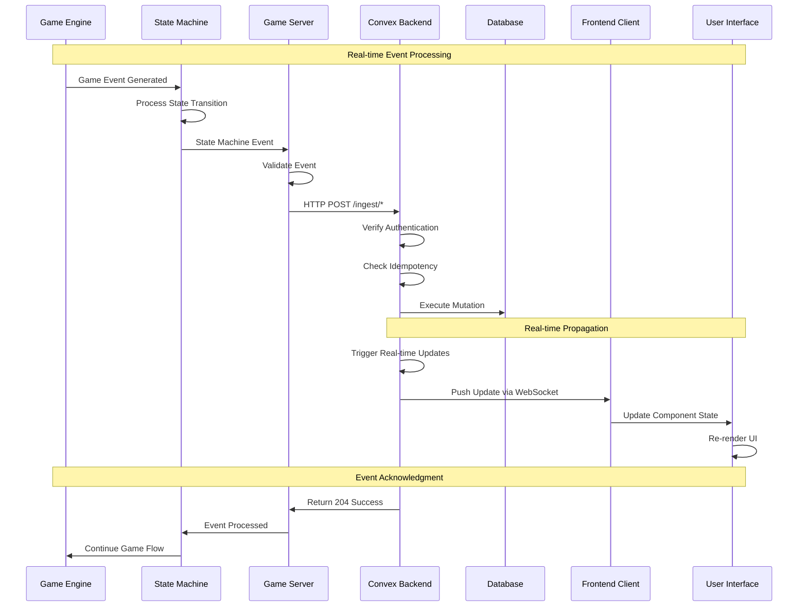

# Convex Real-Time Data Flow

This document focuses on the real-time aspects of the Convex integration, showing how poker game events flow through the system in real-time.

## Real-Time Event Flow

## Event Processing Pipeline

## WebSocket Connection Flow

## Subscription Management

## Data Synchronization Strategy

## Performance Optimization

## Error Handling and Recovery

## Current HTTP Endpoints

The system currently implements the following HTTP endpoints for real-time event ingestion:

| Endpoint | Method | Purpose | Authentication |
|-----------|--------|---------|----------------|
| `/ingest/health` | GET | Health check and debug counts | None |
| `/ingest/handStarted` | POST | Hand start event | `x-convex-ingest-secret` |
| `/ingest/action` | POST | Player action event | `x-convex-ingest-secret` |
| `/ingest/handEnded` | POST | Hand end event | `x-convex-ingest-secret` |
| `/ingest/seat` | POST | Player seated event | `x-convex-ingest-secret` |
| `/ingest/unseat` | POST | Player unseated event | `x-convex-ingest-secret` |
| `/ingest/deal` | POST | Card deal event | `x-convex-ingest-secret` |
| `/ingest/stateMachineEvent` | POST | State machine event | `x-convex-ingest-secret` |
| `/ingest/gameStateSnapshot` | POST | Game state snapshot | `x-convex-ingest-secret` |
| `/ingest/potHistoryEvent` | POST | Pot history event | `x-convex-ingest-secret` |

## State Machine Integration

The current implementation includes a comprehensive state machine system that:

- **Manages Game Flow**: Handles transitions between preflop, flop, turn, river, and showdown
- **Validates Actions**: Ensures player actions are valid for the current game state
- **Tracks Context**: Maintains betting rounds, pot states, and player positions
- **Integrates with Convex**: Sends state machine events to the backend for persistence
- **Provides Debug Controls**: Includes runtime debug mode toggling for development

## Real-Time Metrics

| Metric | Target | Current | Notes |
|--------|--------|---------|-------|
| Event Latency | <100ms | TBD | End-to-end processing |
| UI Update Time | <50ms | TBD | Component re-render |
| WebSocket Ping | <10ms | TBD | Connection health |
| Query Response | <20ms | TBD | Database operations |
| Mutation Success | >99% | TBD | Event processing rate |

## Scaling Considerations

## Development Workflow

## Current Implementation Status

The real-time architecture is currently implemented with:

- ✅ **Convex Backend**: Self-hosted with comprehensive schema and HTTP endpoints
- ✅ **State Machine Integration**: Complete state machine system for game flow management
- ✅ **Event Ingestion**: HTTP-based event ingestion with authentication and idempotency
- ✅ **Frontend Integration**: React components using Convex queries for real-time updates
- ✅ **Game Server**: WebSocket-based server with state machine integration
- ✅ **Debug Controls**: Runtime debug mode toggling for development

This real-time architecture ensures:

- **Immediate UI updates** for better user experience
- **Efficient data synchronization** between game server and frontend
- **Robust error handling** with automatic retry mechanisms
- **Scalable infrastructure** for handling multiple concurrent games
- **Developer-friendly workflow** with hot reloading and real-time testing
- **State machine-driven game flow** for consistent and predictable game behavior
