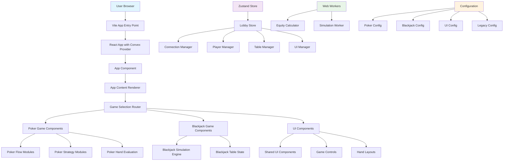
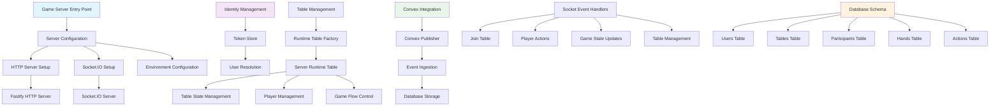
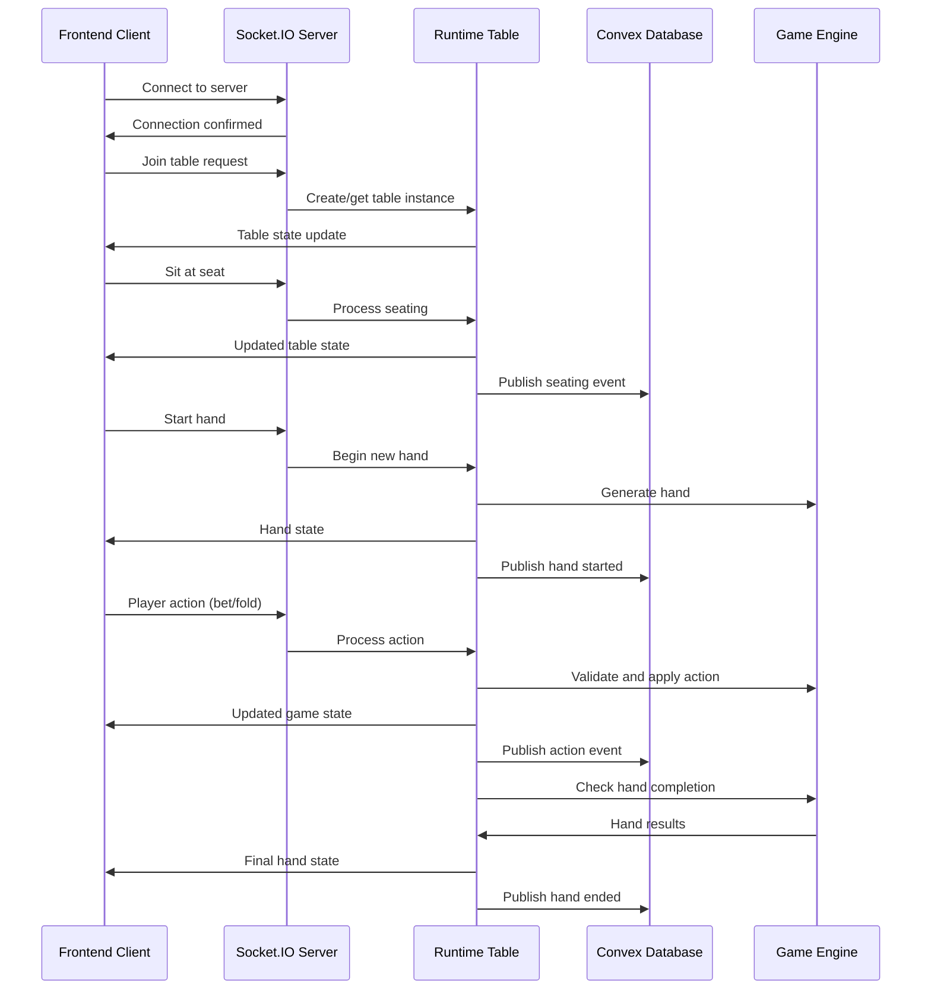
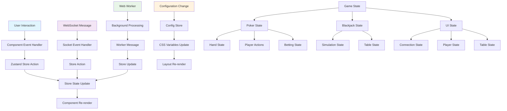
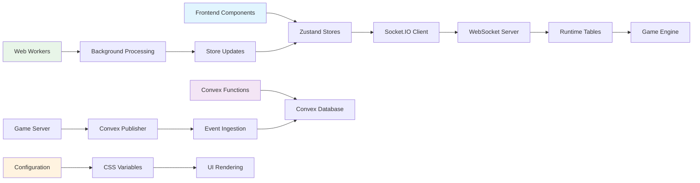
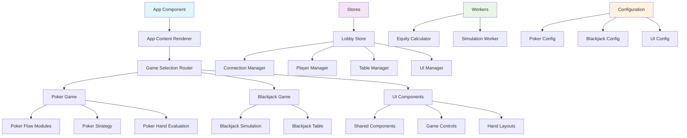

# Montecarlo Application Flow Charts

This document contains comprehensive flow charts representing the major components in the frontend and backend and how they communicate in the Montecarlo casino game application.

## Frontend Architecture Flow

## Backend Architecture Flow

## Real-time Communication Flow

## State Management Flow

## Data Flow Architecture

## Component Communication Patterns

## Key Communication Patterns

### 1. **Frontend to Backend Communication**
- **WebSocket**: Real-time game state updates and player actions
- **HTTP**: Static assets and initial page loads
- **Convex**: Database operations and event ingestion

### 2. **Component Communication**
- **Props**: Parent to child component data flow
- **Events**: Child to parent communication via callbacks
- **Stores**: Global state management with Zustand
- **Context**: React context for deep component trees

### 3. **State Synchronization**
- **Real-time**: WebSocket for immediate game updates
- **Persistent**: Convex database for long-term storage
- **Local**: Zustand stores for UI state and caching

### 4. **Performance Optimization**
- **Web Workers**: CPU-intensive calculations off main thread
- **Memoization**: React.memo and useMemo for expensive renders
- **Selective Updates**: Only affected components re-render
- **Background Processing**: Non-blocking UI operations

## Architecture Benefits

1. **Separation of Concerns**: Clear boundaries between frontend, backend, and database
2. **Real-time Performance**: WebSocket-based communication for immediate updates
3. **Scalability**: Modular architecture allows independent scaling of components
4. **Type Safety**: Full TypeScript coverage with runtime validation
5. **Performance**: Web Workers and optimized rendering for smooth gameplay
6. **Maintainability**: Single responsibility principle with clear module boundaries
