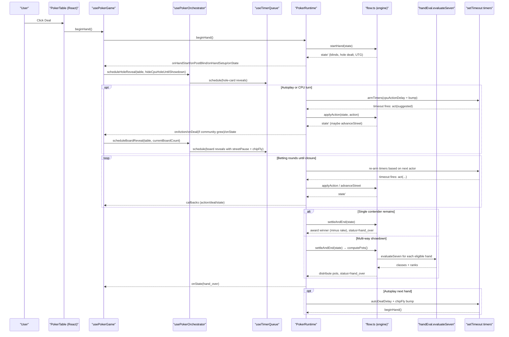

### Poker hand flow: UI → runtime → engine → settlement

```mermaid
sequenceDiagram
participant U as "User"
participant UI as "PokerTable (React)"
participant Hook as "usePokerGame"
participant Orc as "usePokerOrchestrator"
participant Q as "useTimerQueue"
participant RT as "PokerRuntime"
participant Eng as "flow.ts (engine)"
participant Eval as "handEval.evaluateSeven"
participant T as "setTimeout timers"

U->>UI: Click Deal
UI->>Hook: beginHand()
Hook->>RT: beginHand()
RT->>Eng: startHand(state)
Eng-->>RT: state' (blinds, hole dealt, UTG)
RT-->>Hook: onHandStart/onPostBlind/onHandSetup/onState
Hook->>Orc: scheduleHoleReveal(table, hideCpuHoleUntilShowdown)
Orc->>Q: schedule(hole-card reveals)

opt Autoplay or CPU turn
RT->>T: armTimers(cpuActionDelay + bump)
T-->>RT: timeout fires: act(suggested)
RT->>Eng: applyAction(state, action)
Eng-->>RT: state' (maybe advanceStreet)
RT-->>Hook: onAction/onDeal(if community grew)/onState
Hook->>Orc: scheduleBoardReveal(table, currentBoardCount)
Orc->>Q: schedule(board reveals with streetPause + chipFly)
end

loop Betting rounds until closure
RT->>T: re-arm timers based on next actor
T-->>RT: timeout fires: act(...)
RT->>Eng: applyAction / advanceStreet
Eng-->>RT: state'
RT-->>Hook: callbacks (action/deal/state)
end

alt Single contender remains
RT->>Eng: settleAndEnd(state)
Eng-->>RT: award winner (minus rake), status=hand_over
else Multi-way showdown
RT->>Eng: settleAndEnd(state) → computePots()
Eng->>Eval: evaluateSeven for each eligible hand
Eval-->>Eng: classes + ranks
Eng-->>RT: distribute pots, status=hand_over
end

RT-->>Hook: onState(hand_over)
opt Autoplay next hand
RT->>T: autoDealDelay + chipFly bump
T-->>RT: beginHand()
end
```
