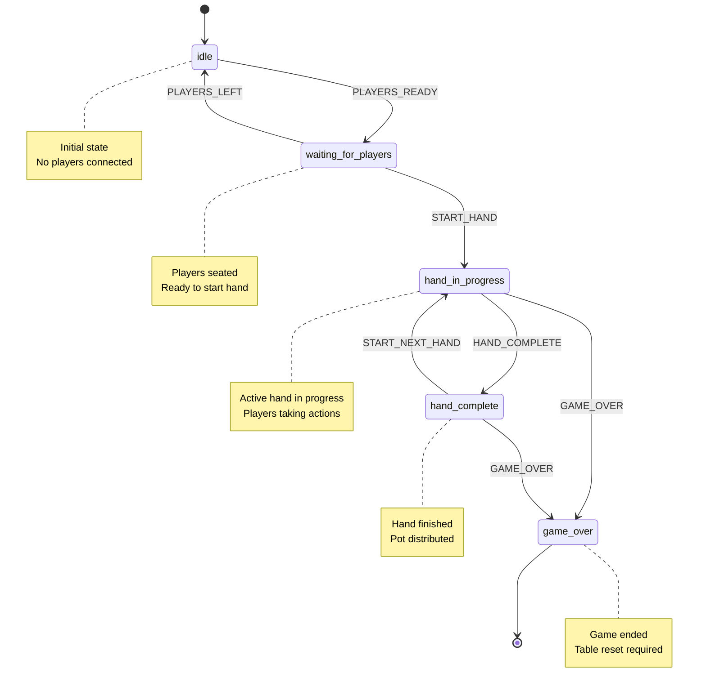
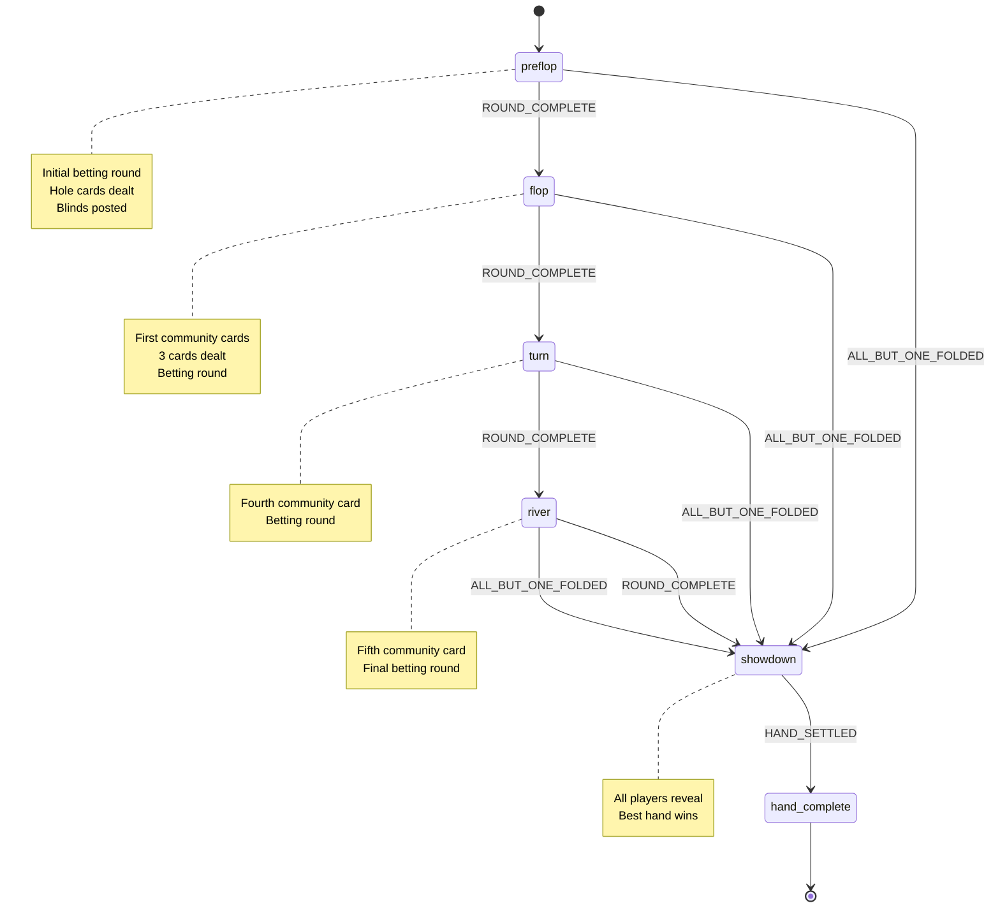
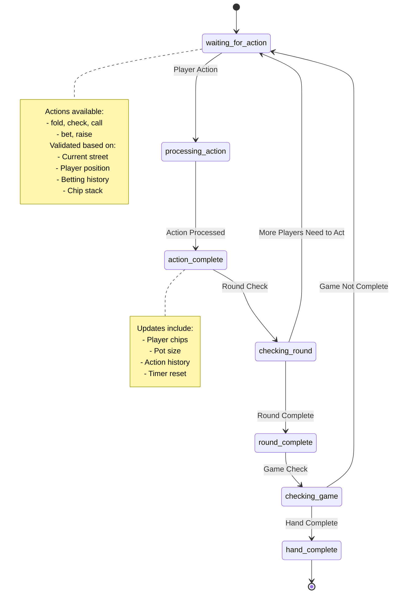
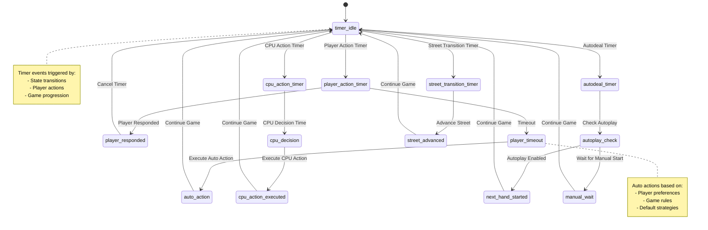
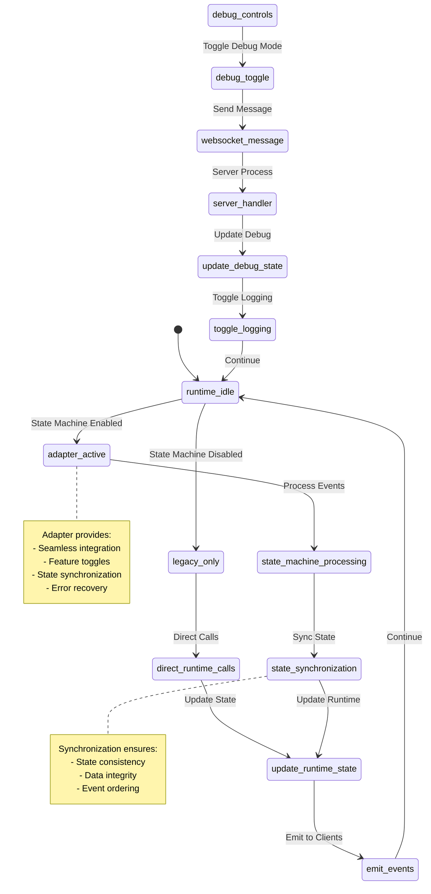
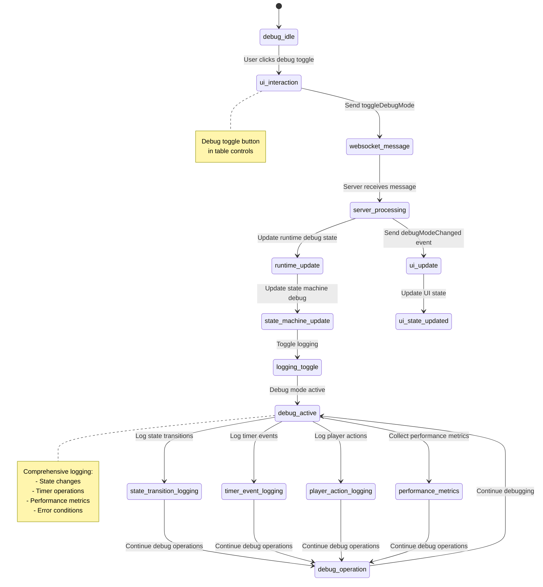
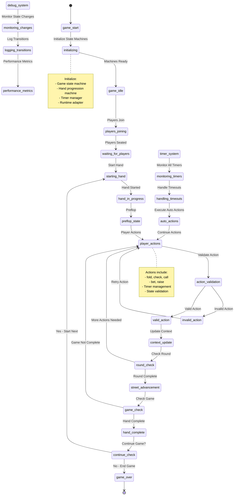
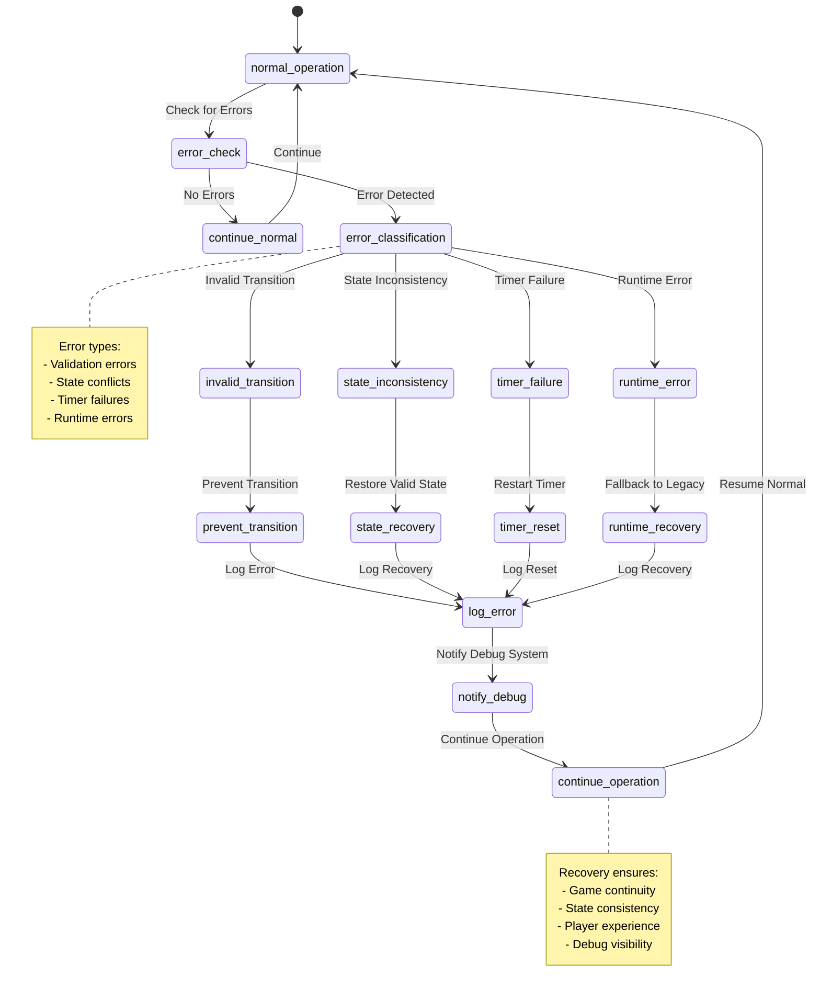
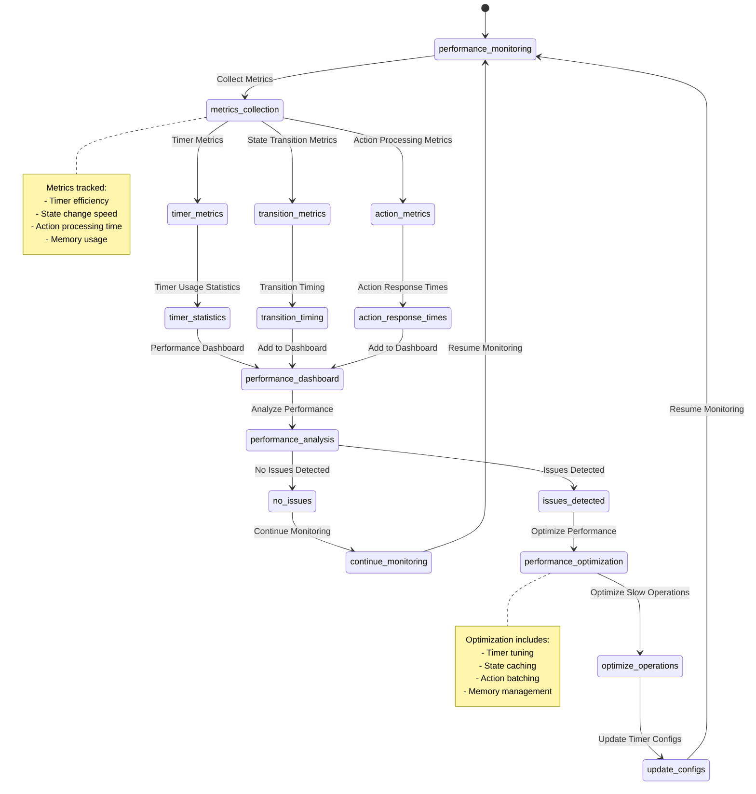
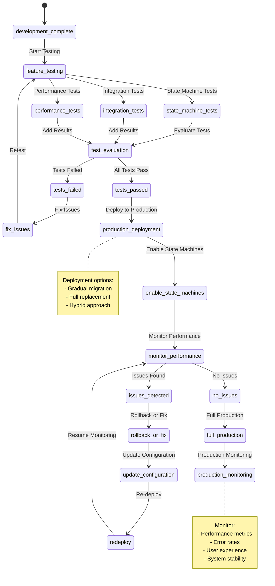

# State Machine System Flowcharts

This document provides visual representations of the state machine system implemented in the Montecarlo poker engine. All diagrams use Mermaid syntax for easy viewing and maintenance.

## Overview

The state machine system consists of several interconnected components:
1. **Game State Machine** - High-level game flow management
2. **Hand Progression Machine** - Detailed hand progression through betting rounds
3. **Timer Integration** - Centralized timer management system
4. **Runtime Integration** - Seamless integration with existing PokerRuntime
5. **Debug Controls** - Real-time debugging and monitoring capabilities

## 1. Game State Machine Flow

## 2. Hand Progression State Machine

## 3. Player Action Flow Within Betting Rounds

## 4. Timer Integration System

## 5. Runtime Integration Architecture

## 6. Debug Control Flow

## 7. Complete State Machine Integration Flow

## 8. Error Handling and Recovery Flow

## 9. Performance Monitoring and Metrics

## 10. Production Deployment Flow

## Summary

These flowcharts provide a comprehensive visual representation of the state machine system implementation. Key features include:

- **Clear State Transitions**: Explicit game flow with validation
- **Hand Progression**: Detailed betting round management
- **Timer Integration**: Centralized timer system for all game events
- **Runtime Integration**: Seamless integration with existing systems
- **Debug Controls**: Real-time debugging and monitoring
- **Error Handling**: Comprehensive error recovery and validation
- **Performance Monitoring**: Built-in metrics and optimization tools
- **Production Ready**: Full integration with deployment options

The system is designed to be maintainable, testable, and production-ready while providing significant improvements over the previous manual state management approach.
